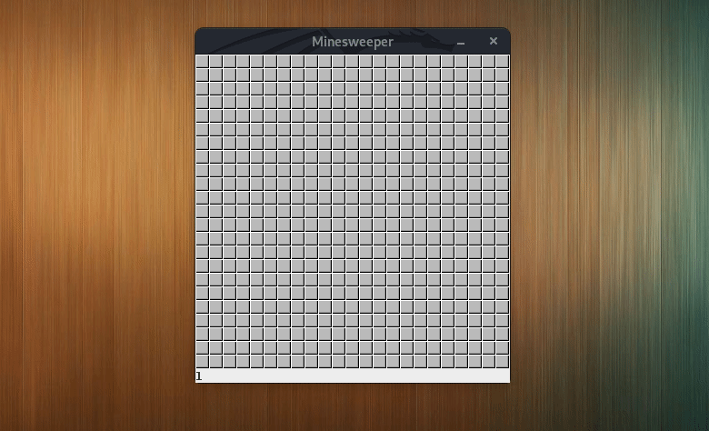
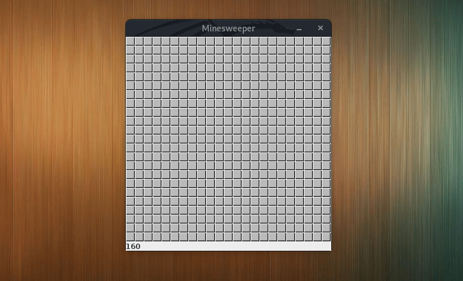
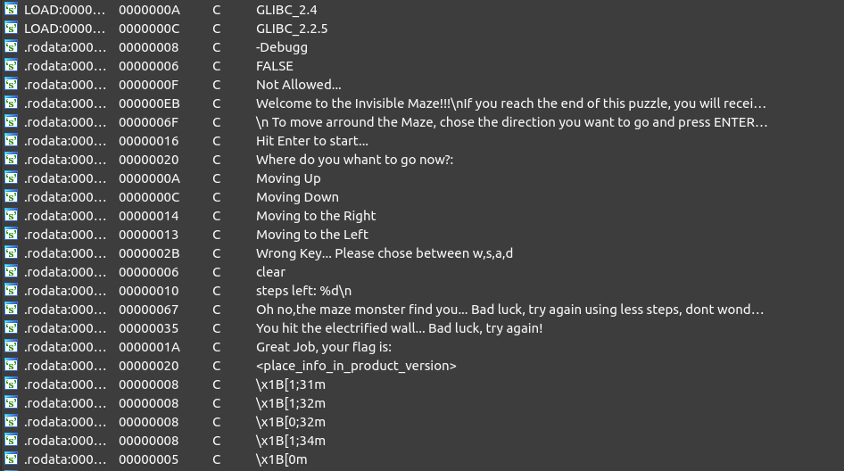
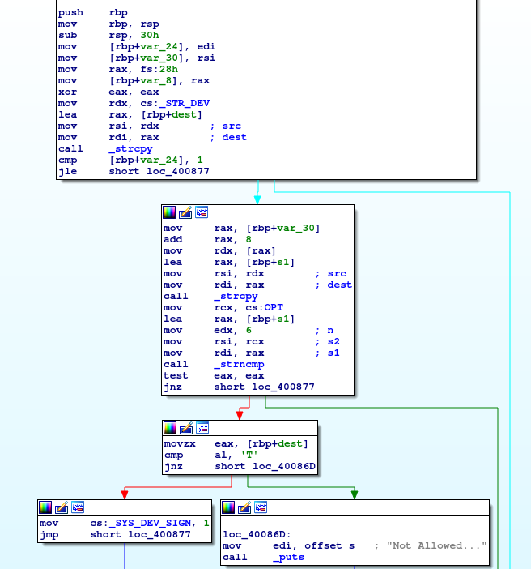
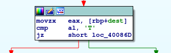
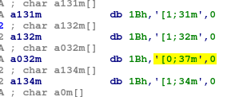
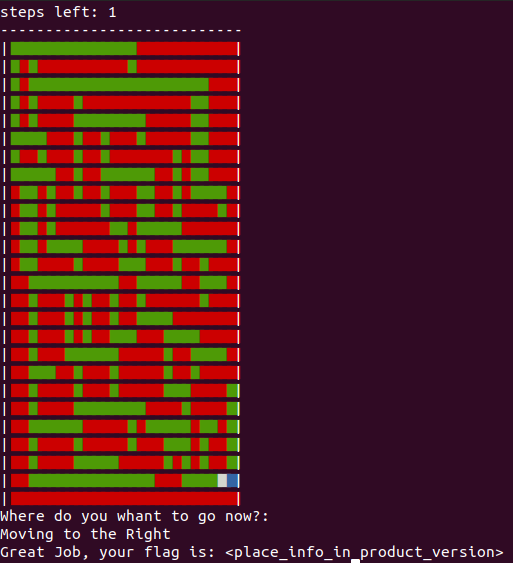
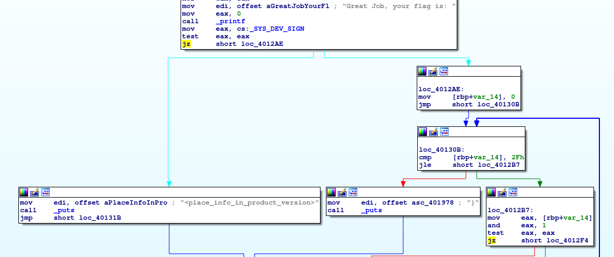
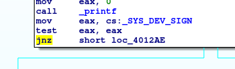
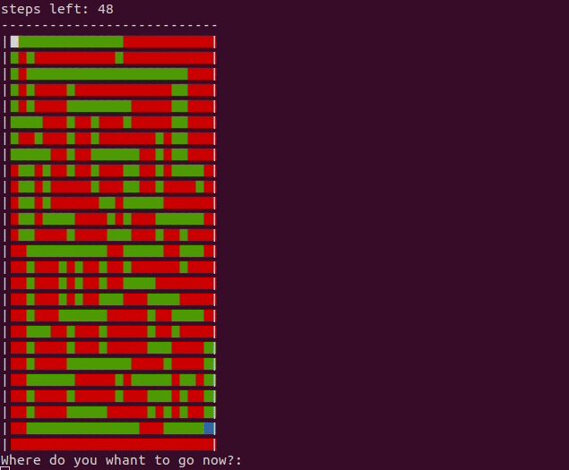

## Introducción

El CTF consistía en 6 niveles de distinta dificultad, la mayoría con temática de video juegos. Los organizadores nos proveían de 6 archivos comprimidos con contraseña. La contraseña para acceder a cada uno de estos niveles era el flag del nivel anterior. 


Para poder comenzar necesita\ábamos obtener la contraseña del primer archivo. En este caso, al momento de registrarnos por Twitter, nos llegaba un mensaje con el primer flag, el cual era: `ONA{We1come_To_0napsis_Ch4llenges}`

## Nivel 1

Usando la contraseña `We1come_To_0napsis_Ch4llenges` abrimos el archivo Lvl1.7z y obtenemos el archivo `Decryptor.py`
Haciendo un análisis rápido del código llegamos al final donde podemos ver lo siguiente:

```python
print "I used this flag as my OS password many years ago... My windows told me that the hash for it was:\n"+HASH[:16]+" "+HASH[16:]
```

La variable `HASH` contiene el string `"8dc26ba686896cc1f9d3a62095d34708"`.

La pista parece indicar que se tratan de hashes LM, los cuales, teniendo en cuenta que tienen una longitud máxima de 7 caracteres y que son sólo mayúsculas, números y símbolos, sabemos que son relativamente fáciles de crackear. En este paso podríamos haber optado por utilizar una herramienta como `hashcat`, pero decidimos primero probar suerte con las herramientes online disponibles. Ambos hashes aparecían en http://rainbowtables.it64.com

|       Hash       | Plaintext |
|:----------------:|:---------:|
| 8dc26ba686896cc1 |  ONA{HAS  |
| f9d3a62095d34708 | H\|\|GO~} |

Tenemos entonces el segundo flag: `ONA{HASH||GO~}`.

## Nivel 2

Este nivel consistía en 3 archivos: `.music`, `knocking.py` y `Requirements.txt`, veamos que nos dice el comando file:

```sh
$ file .music
.music: ASCII text, with very long lines, with no line terminators
$ file knocking.py
knocking.py: python 2.7 byte-compiled
$ file Requeriments.txt
Requeriments.txt: ASCII text
```

Necesitamos obtener el código fuente del archivo `knocking.py`, para esto podemos utilizar una herramienta como `uncompyle6`. El código decompilado es el siguiente:

```python
import os, vlc
from datetime import datetime
import atexit, base64, time
dat = [
 [61, 'Z'], [61, '4'], [61, 'm'], [68, 'x'], [68, 'b'], [68, 'h'], [75, 'Z'], [75, 'a'], [76, 'y'], [82, 'B'], [82, 'd'], [83, 'P'], [148, 'T'], [148, '8'], [149, 'k'], [155, 'F'], [156, 'c'], [156, '7'], [162, 'S'], [163, '9'], [163, '2'], [170, '4'], [170, '2'], [170, 'w'], [234, 'K'], [235, '0'], [235, 'G'], [241, 't'], [242, '7'], [242, 'p'], [249, 'b'], [249, '5'], [250, 'l'], [256, '9'], [256, 'b'], [257, 'J'], [263, 'b'], [264, '4'], [264, 'n'], [271, 'R'], [271, 'd'], [271, 'S'], [278, 'M'], [278, 'f'], [278, 'F'], [285, '9'], [285, 'e'], [286, 'I'], [292, 'Z'], [292, '7'], [293, 'T'], [299, 'R'], [300, '0'], [300, '2'], [306, 'Z'], [307, 'a'], [307, 'U'], [314, '5'], [314, '2'], [314, '9']]

def exit_handler():
    f = open('.KnockinOnHeavensDoor.mp3', 'w')
    f.write('')
    f.close()


def decode(music, outfile):
    f = open(music, 'rb')
    bs64 = f.read()
    f.close()
    out = base64.b64decode(bs64)
    f = open(outfile, 'w')
    for i in out:
        f.write(i)

    f.close()


def knock(initial, tr):
    k = raw_input()
    b = datetime.now()
    delta = b - initial
    delta = abs(delta.seconds - tr[0])
    if delta < 2:
        return tr[1]
    return False


def chrKnock(initial, tn):
    s = ''
    a = knock(initial, dat[tn])
    if a == False:
        return False
    b = knock(initial, dat[(tn + 1)])
    if b == False:
        return False
    c = knock(initial, dat[(tn + 2)])
    if c == False:
        return False
    if a != False:
        s = s + a
        if b != False:
            s = s + b
            if c != False:
                s = a + c
                return s
    return False


print 'Hello rock fan!!! Here is a game you will like'
print 'Give me a minute to generate and load the chords...'
try:
    decode('.music', '.KnockinOnHeavensDoor.mp3')
except:
    print 'some files are missing, please be sure to decompress all the game files in the same folder and play the game!'
    exit()

atexit.register(exit_handler)
print 'Ok, im ready. Hit Intro to start playing the music and dont lose the pitch:'
raw_input()
player = vlc.MediaPlayer('.KnockinOnHeavensDoor.mp3')
player.play()
ini = datetime.now()
f = ''
for i in range(20):
    out = chrKnock(ini, i * 3)
    if out != False:
        f = f + out
    else:
        print '\nYou Failed! You are not listening to the music... Practice some more and try again!'
        print ''
        exit()

time.sleep(7)
print '\nCongratulations, you Rock!!! Here you have your reward:'
print str(base64.b64decode(f))
```

Se observa que lo que hace es ir acumulando en la variable `f` un string codificado en `base64` que al final intenta pasar nuevamente a texto. Pero claro, en la función knock se controla que apretemos la tecla `Enter` en el momento indicado, y en caso de que no sea así, se finaliza el proceso y no podemos obtener el flag. Por lo cual, la solución mas fácil es modificar la función de la siguiente manera:

```python
def knock(initial, tr):
    return tr[1]
```

Ahora sólo tenemos que ejecutar el nuevo archivo:

```sh
$ python knocking_souce.py
Hello rock fan!!! Here is a game you will like
Give me a minute to generate and load the chords...
Ok, im ready. Hit Intro to start playing the music and dont lose the pitch:


Congratulations, you Rock!!! Here you have your reward:
flag ONA{Kn0(kin_IntR0_He4veN}
```

y al final obtenemos el flag.

## Nivel 3

Abrimos el archivo utilizando la clave Kn0(kin_IntR0_He4veN y nos encontramos con un archivo jar. Si tenemos Java instalado podemos ejecutarlo y ver que se trata del clásico Buscaminas, pero con una dificultad un poco mayor: 160 minas :(

Podríamos intentar jugar hasta ganar, pero no soy un gran jugador de buscaminas, así que ni lo intenté. Mi primer idea fue modificar el número de minas para que sea sólo una, pero claro, para hacer esto tenemos que contar con el código de fuente del programa.

Al igual que en el nivel anterior, podemos encontrar varias herramientes que nos ayuden a recuperar el código de fuente, y según el nivel de ofuscación que se haya usado al compilarlo vamos a obtener algo más o menos legible.

En este caso utilicé la herramienta jd-gui. Luego de unos mínimos ajustes (los decompilers no son perfectos) logramos tener un código que podemos re-compilar y ejecutar.

Como comenté anteriormente, la primer idea fue reducir el número de bombas de 160 a 1; una vez hecho esto, ejecuté la nueva versión y ocurrió lo siguiente:



Bueno, éste no fue el resultado esperado, así que me puse a leer el código. Después de un análisis, descubrí que el mapa estaba representado por una matriz, y que cada elemento de la matriz contenía un número que indicaba qué era lo que había realmente en esa celda (una bomba, nada o el número de bombas vecinas). Lo importante acá es notar que la bomba se representa con el número 19.

Una vez finalizado el análisis inicial, lo que hice fue modificar el método que se ejecuta al realizar un click sobre el tablero. Este método, llamado `mousePressed`, hace lo siguiente:
* Descubre sobre qué casillero hicimos click.
* Detecta si hicimos click derecho o izquierdo; en caso de haber hecho click derecho muestra u oculta la banderita, y en caso de haber hecho click izquierdo muestra el contenido de la casilla y ejecuta la acción correspondiente.

La modificación realizada consistía en iterar sobre todos los casilleros del tablero, y mirar si el contenido era el valor 19. Si era lo ignoraba y si no lo era ejecutaba la acción correspondiente. A nivel código era sólo agregar:

```java
for (int n = 0; n < 23; ++n) {
    for (int n2 = 0; n2 < 23; ++n2) {
        if (a.field[n2*23+n] == 19)
            continue;
```

debajo de:

```java
if (!this.a.inGame) {
    this.a.b();
    this.a.repaint();
}
```

De esta forma bastaba sólo con hacer un click, para finalizar el juego exitósamente. Así se ve una vez finalizado:



Y obtenemos el flag `ONA{m1n3$...theR3_@re_MiNe5_Ev3ryw4ere!}`.

## Nivel 4

Este nivel nos introduce en un laberinto del que tendremos que salir sin tocar ninguna de las paredes y utilizando el camino más corto.
Empecemos analizando el binario

```sh
$ file MazeRuner
MazeRuner: ELF 64-bit LSB executable, x86-64, version 1 (SYSV), dynamically linked, interpreter /lib64/ld-linux-x86-64.so.2, for GNU/Linux 2.6.32, BuildID[sha1]=5726c86485f48619a794d4286801e8b450d5194f, not stripped
```

not stripped :)

Empezamos analizando los strings en busca del flag.



Como se puede ver, aparece el string "Great Job, your flag is:". Viendo dónde se usa este string no parece posible (al menos de manera sencilla) obtener el flag. Pero en esta misma lista de strings podemos observar uno muy interesante: "-Debugg". Este string se referencia en la función `main`, más precisamente en el parseo de argumentos.



Como se puede ver, en las primeras líneas de la función `main` se determina si la aplicación se está corriendo en modo debug o no. Esto lo hace verificando que se le pase como argumento la palabra "-Debug" (chequea los primeros 6 caracteres) y que el string referenciado por `_STR_DEV` empiece con la letra `T`.

El argumento no es un problema porque se lo pasamos por línea de comandos, pero el string `_STR_DEV` está hardcodeado. Las dos opciones más fáciles para solucionar esto serían:
* Cambiar la letra `F` de false por una `T`.
* Modificar el salto condicional que hay luego de la comparación para invertirlo.

Esta última opción fue la elegida.



```sh
$ ./MazeRuner -Debug
```

Bien, ahora podemos ver los caminos por los que debemos movernos y las paredes eléctricas... Pero ya no es fácil distinguir la posición actual. Así que hay que aplicar un nuevo parche para cambiar el verde (`\x1B[0;32m`) por el blanco (`\x1B[0;37m`):



Ya se puede distinguir claramente la posición actual, sólo falta buscar el camino más corto y...



Ups... Veamos dónde se hace referencia a ese string `<place_info_in_product_version>` en el código:



Remarcado en amarillo en la parte superior se puede ver el salto. Si se toma el camino de la izquierda se imprime el string anterior, si se toma el camino de la derecha se imprime ¿el flag?. Veamos qué pasa invirtiendo ese salto:



```sh
$ ./MazeRuner -Debug
```


Y llegamos al flag `ONA{1_tr0pez0n_!=_ca1d4?}`.

# Nivel 5

Nada divertido por acá, solo copié el Sudoku en un solver online y lo completé según la solución obtenida. Vale aclarar que este nivel consistía en dos Sudokus, cada uno te daba una mitad el flag. El sitio utilizado para resolver el Sudoku fue: https://www.dcode.fr/hexadoku-sudoku-16-solver

Flag obtenido: `ONA{sUd0_5uDO_5Ud0KUuu!!!}`.

# Nivel 6

En este nivel contábamos con dos archivos ejecutables jar y dos archivos de log. 

Los archivos jar eran un cliente y un servidor que permiten el intercambio de información utlizando un mecanismo de cifrado.

Los archivos de logs eran los siguientes:
* communication.dispatchers.ServerDispatcher.log: Contiene un registro de las tareas que fueron realizando los clientes en el servidor.
* crypto.Key.log: Contiene un registro de los mensajes cifrados intercambiados ente el servidor y los clientes.
Vale aclarar que los clientes se identifican por un numero entero, el cual aparece en ambos logs, por lo cual es facil asociar los mensajes de un log con los mensajes del otro.

Luego de utilizar alguna herramienta para descompilar los archivos jar, podemos empezar a realizar un análisis del código.

En un primer análisis busqué dónde se estaba enviando el flag para ver cómo se estaba generando o calculando. Pero vi que se estaba sacando de una variable de entorno:

```java
this.flag = System.getenv("SEC_FLAG");
```

Por lo que no hay muchas más opciones que intentar descifrar los mensajes intercambiados.
Haciendo algunas búsquedas en el código, llego a las funciones encargadas de cifrar y descifrar los mensajes, aquí se puede ver que se está usando criptografía simétrica, por lo que tanto el servidor como el cliente tienen que compartir la misma clave. 

```java
protected String encrypt(String data) {
    data = data.replace(" ", "~");
    data = data.replace(".", "|");
    final StringBuilder sb = new StringBuilder();
    for (int i = 0; i < data.length(); ++i) {
        final int indx = i % 26;
        final char enc = (char)(data.charAt(i) ^ this.key.charAt(indx));
        sb.append(enc);
    }
    return Base64.getEncoder().encodeToString(sb.toString().getBytes());
}

protected String decrypt(final String data) {
    final String decData = new String(Base64.getDecoder().decode(data));
    final StringBuilder sb = new StringBuilder();
    for (int i = 0; i < decData.length(); ++i) {
        final int indx = i % 26;
        final char dec = (char)(decData.charAt(i) ^ this.key.charAt(indx));
        sb.append(dec);
    }
    String out = sb.toString();
    out = out.replace("~", " ");
    out = out.replace("|", ".");
    return out;
}
```

Analicemos la creación del cliente:

```java
private ClientPlatform(final String serverHost, final int serverPort) throws IOException {
    super(serverHost, serverPort);
    (this.client = new Agent()).setKey(Agent.SERVER_KEY);
    this.newDispatcher();
}
```

Como se puede ver, ademas del host y del puerto (ingresados por el usuario manualmente al iniciar la aplicación) se está seteando la clave del cliente utilizando una constante como parámetro. `Agent.SERVER_KEY` está definida en la clase `Agent` de la siguiente manera:

```java
SERVER_KEY = new Key(79824387432L);
```
Estos son los constructores de la clase Key:

```java
public Key() {
    this(System.currentTimeMillis());
}

public Key(final String key) {
    final String extKey = String.valueOf(key) + "ABCDEFGHIJKLMNOPQRSTUVWXYZ";
    this.key = extKey.substring(0, 26);
    this.uid = -1.0;
    this.seed = -1L;
}

public Key(final long seed) {
    this.seed = seed;
    final Random r = new Random(seed);
    this.uid = r.nextDouble();
    final StringBuilder sb = new StringBuilder();
    for (int i = 0; i < 26; ++i) {
        sb.append((char)(r.nextDouble() * 256.0));
    }
    this.key = sb.toString();
}
```

Ahora tenemos todo lo necesario para descifrar los mensajes. Si observamos el archivo `communication.dispatchers.ServerDispatcher.log` vemos que hay tres clientes que recibieron el flag del servidor. Podemos elegir cualquiera de ellos, en mi caso elegí el agente 1943329308.

```
New message from Agent 1943329308. Ecnrypted message: wqZUwpECEsOAw5nCm1E= 
New message to Agent 1943329308. Ecnrypted message: wq5Zwp8DH8OCw5LCn1nCncK1R8Km 
New message from Agent 1943329308. Ecnrypted message: NE5BCgPDqWJsMW1vwq9wwr1ZKSvCqcKOS8Odw6DDsDNhMA== 
New message to Agent 1943329308. Ecnrypted message: BgIGC0HCgQQxZCc+w6gYwo5cPznCvMKDD8KAwo3DuDdrLgYKCQ5HwoU= 
New message from Agent 1943329308. Ecnrypted message: BlxUAQXDik9kO2x5wrJAwoNGOCrCv8KXVsOHw5vCpHIhKRVPTwEUw5NVeix+f8KvQMKfUSA5wqrCiFbDlw== 
New message to Agent 1943329308. Ecnrypted message: ClJCHBjDmV93On58wr5RwopKPz3CsMKfVcOQw5jCqXU= 
New message from Agent 1943329308. Ecnrypted message: FV5AGhTDhUVgPHh0wq9Owp9fPyzCoMKNUMOKw4s= 
New message to Agent 1943329308. Ecnrypted message: E1paCg/Dkl5+PGF+wrpdwopdLivCosKfSsOXw57CqmQuMgtUWgYNw4hFYTdhYcKyQcKKRCQ/wrLCgF3DkMOewrVuIA== 
New message from Agent 1943329308. Ecnrypted message: KcO6YsOmwqU3w4fCj8Onw6HCusKew5HDpcKOGBZ3w544AcKZVTsXwpQ= 
New message to Agent 1943329308. Ecnrypted message:  
New message from Agent 1943329308. Ecnrypted message: PMKkIsO8wrHDssKCw6/Dm8KZw442wp9uw5M8JsOGSnLDnVjDvVQjwrc8wqwyw73CvcOuwpg= 
New message to Agent 1943329308. Ecnrypted message: IsKuMMOiwrDDrsKBw6jDi8KXw4M7woxtw5cmN8OXXnXDhkPDol83wr88wqQ2w6fCqMO/wo/DqcOAwoDDhyzCkmTDiCwrw4xbf8OMTsOxRCPCtC/Cpi/Dt8Kzw67CmcOiw4vCksOFJsKV 
New message from Agent 1943329308. Ecnrypted message: OsKpNsO3wqfDpMKVw7TDkMKKw44jwpJpw5E8J8OaQU7DtmfDr0c= 
New message to Agent 1943329308. Ecnrypted message: OsKpNsO3wqfDpMKVw7TDkMKKw44jwpJpw5E8J8OaQW7DlkfDr1IkwrslwqQhw7rCqMOtwpnDsMOQwoLDgiTCkGzDmS89w5Q= 
```

Vamos a copiar los textos cifrados a una lista en Java e intentar desencriptar uno a uno los mensajes utilizando la clave `SERVER_KEY`.

```java
String MESSAGES[] = new String[] {
    "wqZUwpECEsOAw5nCm1E=", "wq5Zwp8DH8OCw5LCn1nCncK1R8Km", "NE5BCgPDqWJsMW1vwq9wwr1ZKSvCqcKOS8Odw6DDsDNhMA==",
    "BgIGC0HCgQQxZCc+w6gYwo5cPznCvMKDD8KAwo3DuDdrLgYKCQ5HwoU=",
    "BlxUAQXDik9kO2x5wrJAwoNGOCrCv8KXVsOHw5vCpHIhKRVPTwEUw5NVeix+f8KvQMKfUSA5wqrCiFbDlw==",
    "ClJCHBjDmV93On58wr5RwopKPz3CsMKfVcOQw5jCqXU=", "FV5AGhTDhUVgPHh0wq9Owp9fPyzCoMKNUMOKw4s=",
    "E1paCg/Dkl5+PGF+wrpdwopdLivCosKfSsOXw57CqmQuMgtUWgYNw4hFYTdhYcKyQcKKRCQ/wrLCgF3DkMOewrVuIA==", 
    "KcO6YsOmwqU3w4fCj8Onw6HCusKew5HDpcKOGBZ3w544AcKZVTsXwpQ=",
    "PMKkIsO8wrHDssKCw6/Dm8KZw442wp9uw5M8JsOGSnLDnVjDvVQjwrc8wqwyw73CvcOuwpg=", 
    "IsKuMMOiwrDDrsKBw6jDi8KXw4M7woxtw5cmN8OXXnXDhkPDol83wr88wqQ2w6fCqMO/wo/DqcOAwoDDhyzCkmTDiCwrw4xbf8OMTsOxRCPCtC/Cpi/Dt8Kzw67CmcOiw4vCksOFJsKV",
    "OsKpNsO3wqfDpMKVw7TDkMKKw44jwpJpw5E8J8OaQU7DtmfDr0c=", 
    "OsKpNsO3wqfDpMKVw7TDkMKKw44jwpJpw5E8J8OaQW7DlkfDr1IkwrslwqQhw7rCqMOtwpnDsMOQwoLDgiTCkGzDmS89w5Q=" };

crypto.Key key = Agent.SERVER_KEY;
Message m = new HandShake(null, null);

for (String message : MESSAGES) {	
    m.setData(mensaje);
    System.out.println(key.decrypt(m).getData());
}
```

Ejecutamos el nuevo código:

```
987654321
1597868690480
«"ç>$ˆÅQÀîÐæO¨›ÀxüæF9
™n ?fu¿—Ž.­ÒmñH»+1‰Ž™f¯:`q
™0ò5">¥Í[ÁøÍÖq·ŠÁnåü}mÌ_‰Š#é53'¿ÓLÓþÐÖm ’Ò{úì
•>ä(?-µÞZÓýÁÇx»Öaíë `Ë
Š2æ.31¯É\ÕõÐØm®Çqÿñm
Œ6ü>(&´×\ÌÿÅËx¬œÀsí
ìxcÚP’”8ü2*<¯ÈWÌàÍ×xµ–Ôcòëx.Ð^
¶–Ä҂Ã-&‡L;áGªý¦¬:?œ…i4
£È„È–hF»4OI	œ"ŽÍ85æþ4ê]£À”Éšr
½Â–Ö—kA«:BDŸ&”Ü,2ýå+áI£ÈÓe@ -FS–9žÀ)8÷è8ú]°Ê‰Ã”sK«?DY
¥ÅÃ€]°'O\› ŽÌ3	ÍÁ&ù
¥ÅÃ€]°'O\› ŽÌ3)íá&ìZºÈ‡ÎsY°/C[ž(Ö
```

Los primeros dos mensajes parecen válidos, pero después se rompió todo :(

¿Qué pasó? Al inicio de la comunicación se produce una especie de handhake o registro y en este proceso el servidor envía al cliente un seed; el agente deberá generar una nueva instancia de la clase `Key` utilizando este seed y utilizar esta nueva clave para comunicarse con el servidor.

Este proceso puede verse en el método `Register` de la clase `ClientDispatcher`:
```java
public int Register(final Agent agent, final Agency agency) throws UnknownHostException, IOException, ClassNotFoundException {
    final HandShake request = new HandShake(agent, agency, 987654321L);
    this.sendMessage(request, Agent.SERVER_KEY);
    final HandShake response = (HandShake)this.listenMessage(Agent.SERVER_KEY);
    if (response.getErrorCode() == 0) {
        final Key newKey = new Key(response.getSeed());
        agent.setKey(newKey);
        agency.setKey(newKey);
    }
    return response.getErrorCode();
}
```
Vamos a actualizar el script:
```java
String MESSAGES[] = new String[] {
        "wqZUwpECEsOAw5nCm1E=", "wq5Zwp8DH8OCw5LCn1nCncK1R8Km", "NE5BCgPDqWJsMW1vwq9wwr1ZKSvCqcKOS8Odw6DDsDNhMA==",
        "BgIGC0HCgQQxZCc+w6gYwo5cPznCvMKDD8KAwo3DuDdrLgYKCQ5HwoU=",
        "BlxUAQXDik9kO2x5wrJAwoNGOCrCv8KXVsOHw5vCpHIhKRVPTwEUw5NVeix+f8KvQMKfUSA5wqrCiFbDlw==",
        "ClJCHBjDmV93On58wr5RwopKPz3CsMKfVcOQw5jCqXU=", "FV5AGhTDhUVgPHh0wq9Owp9fPyzCoMKNUMOKw4s=",
        "E1paCg/Dkl5+PGF+wrpdwopdLivCosKfSsOXw57CqmQuMgtUWgYNw4hFYTdhYcKyQcKKRCQ/wrLCgF3DkMOewrVuIA==", 
        "KcO6YsOmwqU3w4fCj8Onw6HCusKew5HDpcKOGBZ3w544AcKZVTsXwpQ=",
        "PMKkIsO8wrHDssKCw6/Dm8KZw442wp9uw5M8JsOGSnLDnVjDvVQjwrc8wqwyw73CvcOuwpg=", 
        "IsKuMMOiwrDDrsKBw6jDi8KXw4M7woxtw5cmN8OXXnXDhkPDol83wr88wqQ2w6fCqMO/wo/DqcOAwoDDhyzCkmTDiCwrw4xbf8OMTsOxRCPCtC/Cpi/Dt8Kzw67CmcOiw4vCksOFJsKV",
        "OsKpNsO3wqfDpMKVw7TDkMKKw44jwpJpw5E8J8OaQU7DtmfDr0c=", 
        "OsKpNsO3wqfDpMKVw7TDkMKKw44jwpJpw5E8J8OaQW7DlkfDr1IkwrslwqQhw7rCqMOtwpnDsMOQwoLDgiTCkGzDmS89w5Q=" };

crypto.Key key = Agent.SERVER_KEY;
Message m = new HandShake(null, null);
int currentMessage = 0;

for (String message : MESSAGES) {
    currentMessage++;
    m.setData(message);
    String plainText = key.decrypt(m).getData();
    if (currentMessage == 2) {
        key = new Key(Long.valueOf(plainText));
        System.out.println("Key was updated.");
    } else {
        System.out.println(plainText);
    }
}
```

Lo ejecutamos:

```
987654321
Key was updated.
Super_Secret_Password_123.
a97d075868437cdeabb692969ba18a63
agent. mission bravo dessert needs autorization
mission have green light
requesting target list
take down targets. snake. loki. the king. gladiator
NÁS‰Ôö†µþ°Eþ¶BN©?¸&”:EØ
[Ÿ“ÀD³æ‰†Äí°ƒëf «Kdç<Uqû[—’ÌX©
E•ÁX°á™ˆÉࣀï.o	¿Lü#^eó[ŸˆÙI¾à’ŸÍ÷½‰ðvsºFuñ0EqøH˜ÂX¨ë™Ïýº
]’˜ÖR¤ý‚•Äø½„éf wOØ.F
]’˜ÖR¤ý‚•Äø½„éf Woø.Sv÷BŸ•Ù[¨ù‚Èÿ¿áue
```

¿Y ahora qué pasó? El cliente puede optar por cambiar de clave en algún momento de la comunicación, para esto crea una nueva instancia de la clase Key usando el timestamp actual como argumento; una vez generada debe enviársela al servidor, para que puedan seguir la comunicación utilizando la nueva clave.

Esta lógica puede verse en el método `secretActions` de `ClientPlatform`, más precisamente en el `case` 1 del `switch`.

```java
this.getClient().setKey(new Key());
final int code = this.getDispatcher().setAgentKey(this.getClient(), this.getServer(), this.getClient().getKey());
if (code == 0) {
    Platform.write("Key established. All communication will be encrypted with your own Key.");
    break;
}
writeErrorMessage(code);
break;
```

Por lo tanto el mensaje siguiente a `take down targets. snake. loki. the king. gladiator` era válido, y era el valor de la nueva clave.
Actualizo el script con esta nueva información:

```java
String MESSAGES[] = new String[] {
        "wqZUwpECEsOAw5nCm1E=", "wq5Zwp8DH8OCw5LCn1nCncK1R8Km", "NE5BCgPDqWJsMW1vwq9wwr1ZKSvCqcKOS8Odw6DDsDNhMA==",
        "BgIGC0HCgQQxZCc+w6gYwo5cPznCvMKDD8KAwo3DuDdrLgYKCQ5HwoU=",
        "BlxUAQXDik9kO2x5wrJAwoNGOCrCv8KXVsOHw5vCpHIhKRVPTwEUw5NVeix+f8KvQMKfUSA5wqrCiFbDlw==",
        "ClJCHBjDmV93On58wr5RwopKPz3CsMKfVcOQw5jCqXU=", "FV5AGhTDhUVgPHh0wq9Owp9fPyzCoMKNUMOKw4s=",
        "E1paCg/Dkl5+PGF+wrpdwopdLivCosKfSsOXw57CqmQuMgtUWgYNw4hFYTdhYcKyQcKKRCQ/wrLCgF3DkMOewrVuIA==", 
        "KcO6YsOmwqU3w4fCj8Onw6HCusKew5HDpcKOGBZ3w544AcKZVTsXwpQ=",
        "PMKkIsO8wrHDssKCw6/Dm8KZw442wp9uw5M8JsOGSnLDnVjDvVQjwrc8wqwyw73CvcOuwpg=", 
        "IsKuMMOiwrDDrsKBw6jDi8KXw4M7woxtw5cmN8OXXnXDhkPDol83wr88wqQ2w6fCqMO/wo/DqcOAwoDDhyzCkmTDiCwrw4xbf8OMTsOxRCPCtC/Cpi/Dt8Kzw67CmcOiw4vCksOFJsKV",
        "OsKpNsO3wqfDpMKVw7TDkMKKw44jwpJpw5E8J8OaQU7DtmfDr0c=", 
        "OsKpNsO3wqfDpMKVw7TDkMKKw44jwpJpw5E8J8OaQW7DlkfDr1IkwrslwqQhw7rCqMOtwpnDsMOQwoLDgiTCkGzDmS89w5Q=" };

crypto.Key key = Agent.SERVER_KEY;
Message m = new HandShake(null, null);
int currentMessage = 0;

for (String message : MESSAGES) {
    currentMessage++;
    m.setData(message);
    String plainText = key.decrypt(m).getData();
    if (currentMessage == 2) {
        key = new Key(Long.valueOf(plainText));
        System.out.println("Key was updated.");
    }
    else if (!arePintableChars(plainText)) {
        key = new Key(plainText);
        System.out.println("Key was updated.");
    } else {
        System.out.println(plainText);
    }
}
```

Lo ejecutamos una vez más:

```
987654321
Key was updated.
Super_Secret_Password_123.
a97d075868437cdeabb692969ba18a63
agent. mission bravo dessert needs autorization
mission have green light
requesting target list
take down targets. snake. loki. the king. gladiator
Key was updated.
requesting safe house information
lockdown is ready at evergreen. you will need the flag. good luck
the secret flag is ONA{}
the secret flag is ona{hackers.love.randoms}
```

Y ahora si llegamos al flag `ona{hackers.love.randoms}`.

Es interesante notar que si bien el método de cifrado que se usa (data xor clave), bajo ciertas condiciones puede considerarse irrompible, el hecho de que se esté reutilizando una misma clave para más de un mensaje, o de que el tamaño de la clave esté limitado a 26 caracteres pero no exista un límite para el tamaño del mensaje que se transmite, provocan que un análisis de frecuencia sea posible, por lo cual teóricamente sería posible encontrar el flag de este nivel aún sin contar con los ejecutables.